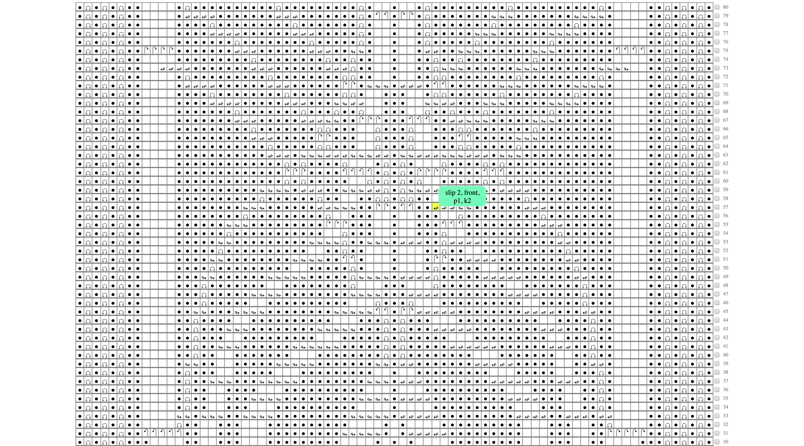

# Click Click Knit
## A tool to help read knitting patterns

* hover over symbols for knitting notes
* click and drag across stitches to get the stitch count in a row
* check off the row when complete to gray it out

[See it in action here](https://twelve13.github.io/click-click-knit/)

